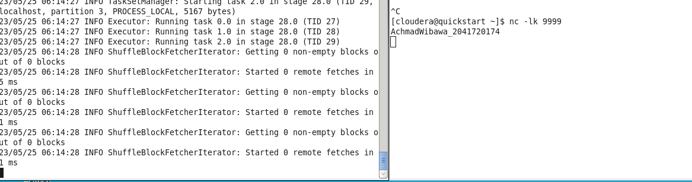
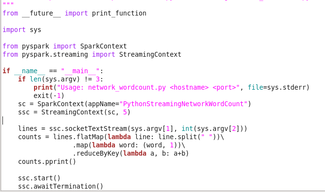
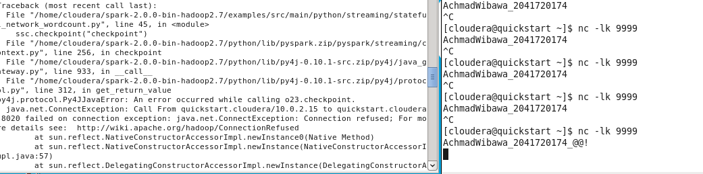
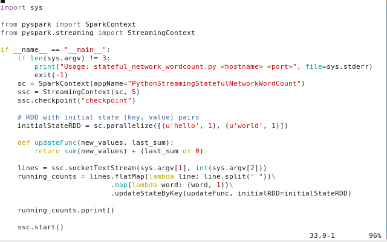
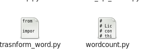
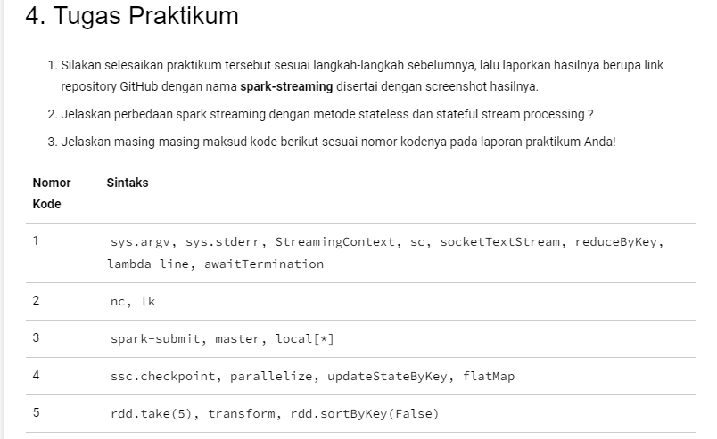

<h1>Kode Program</h1>
<ul>
  <li>Masuk Directory
    <ol>
      <li></li>
    </ol>
  </li>
  <li>Metode 1 Mode Stateless Stream Processing
    <ol>
      <li></li>
      <li></li>
    </ol>
  </li>
  <li>Metode 2 Mode Stateful Stream Processing
    <ul>
      <li></li>
      <li></li>
    </ul>
  </li>
  <li>Metode 3 Melakukan Transformasi di Spark Streaming
    <ul>
      <li></li>
    </ul>
  </li>
</ul>
<h1>Soal</h1>

 
<h1>Jawaban</h1>
<b>nomor 2</b>
<ul>
  <li>Spark Streaming dengan metode stateless hanya memproses setiap data secara terpisah tanpa mempertimbangkan data sebelumnya, sementara metode stateful dapat menyimpan status (state) dari data dan memungkinkan pemrosesan yang lebih kompleks yang melibatkan data historis.</li>
</ul>
<b>nomor 3</b>
<ol>
  <li>
    <ul>
      <li>sys.argv: sys.argv adalah sebuah list yang berisi argumen baris perintah yang diberikan saat menjalankan sebuah program Spark. Argumen ini dapat digunakan untuk mengatur konfigurasi atau memberikan input kepada program Spark.</li>
      <li>sys.stderr: sys.stderr adalah aliran keluaran standar yang digunakan untuk menampilkan pesan kesalahan (error) saat menjalankan program Spark. Pesan-pesan kesalahan akan ditampilkan di konsol atau log yang relevan.</li>
      <li>StreamingContext: StreamingContext adalah kelas dalam Spark Streaming yang bertanggung jawab untuk mengatur konteks dan konfigurasi dari aplikasi streaming. Ini mencakup konfigurasi seperti interval batch (waktu antara dua batch), konfigurasi cluster, dan lain-lain.</li>
      <li>sc: sc (SparkContext) adalah konteks utama dalam Spark yang bertanggung jawab untuk berinteraksi dengan kluster dan mengatur sumber daya komputasi. Ini digunakan untuk membuat RDD (Resilient Distributed Datasets) dan melakukan operasi transformasi dan aksi pada data.</li>
      <li>socketTextStream: socketTextStream adalah metode dalam StreamingContext yang digunakan untuk membuat DStream (Discretized Stream) dari data yang diterima melalui koneksi socket. Ini memungkinkan aplikasi Spark Streaming untuk menerima data secara real-time melalui socket.</li>
      <li>reduceByKey: reduceByKey adalah operasi dalam Spark yang digunakan untuk menggabungkan nilai-nilai yang sesuai dengan kunci yang sama. Operasi ini digunakan untuk melakukan agregasi pada data streaming dengan kunci, seperti menghitung jumlah atau melakukan operasi matematika pada data yang terkait dengan kunci yang sama.</li>
      <li>lambda line: lambda adalah ekspresi anonim dalam Python yang digunakan untuk membuat fungsi sederhana tanpa harus mendefinisikan nama fungsi secara eksplisit. Dalam konteks Spark Streaming, lambda line digunakan untuk mendefinisikan fungsi yang diterapkan pada setiap elemen data streaming (misalnya, setiap baris teks dalam streaming data).</li>
      <li>awaitTermination: awaitTermination adalah metode dalam StreamingContext yang digunakan untuk menjalankan aplikasi Spark Streaming secara terus-menerus sampai dihentikan secara eksplisit. Metode ini akan memblokir eksekusi aplikasi sampai aplikasi dihentikan secara manual atau terjadi kesalahan.</li>
    </ul>
  </li>
  <li>
    <ul>
      <li>nc: nc adalah singkatan dari "netcat" yang merupakan utilitas jaringan yang digunakan untuk membaca dan menulis data melalui koneksi jaringan menggunakan protokol TCP atau UDP. Dalam konteks Spark Streaming, nc bisa digunakan untuk mengirimkan data streaming melalui koneksi socket kepada aplikasi Spark Streaming.</li>
      <li>lk: adalah fungsi Spark Streaming yang membaca data dari koneksi jaringan. Fungsi lk mengambil dua argumen: nama host atau alamat IP server, dan nomor port server.</li>
    </ul>
  </li>
  <li>
    <ul>
      <li>spark-submit: spark-submit adalah perintah baris perintah yang digunakan untuk mengirimkan (submit) aplikasi Spark untuk dieksekusi ke cluster Spark. Perintah ini digunakan untuk mengirimkan aplikasi Spark dalam bentuk JAR atau Python script ke cluster, dan menjalankannya menggunakan Spark.</li>
      <li>master: master adalah parameter yang digunakan dalam spark-submit untuk menentukan di mana aplikasi Spark akan dijalankan. Ini mengacu pada URL dari manajer cluster Spark yang digunakan untuk mengendalikan distribusi dan penjadwalan tugas. Beberapa contoh nilai yang bisa digunakan adalah "local", "local[*]", "yarn", "mesos", dan "spark://host:port".</li>
      <li>local[*]: adalah nilai khusus untuk argumen master yang berarti bahwa pekerjaan akan dijalankan di mesin lokal menggunakan semua core yang tersedia.</li>
    </ul>
  </li>
  <li>
    <ul>
      <li>ssc.checkpoint: ssc.checkpoint adalah metode dalam StreamingContext yang digunakan untuk mengatur titik kontrol (checkpoint) dalam aplikasi Spark Streaming. Titik kontrol adalah mekanisme untuk menyimpan metadata yang diperlukan untuk menjaga keandalan pemrosesan data streaming. Dengan menggunakan ssc.checkpoint, Anda dapat menentukan direktori di mana data checkpoint akan disimpan untuk pemulihan dan toleransi kesalahan.</li>
      <li>parallelize: parallelize adalah metode dalam SparkContext yang digunakan untuk membuat RDD (Resilient Distributed Dataset) dari koleksi data yang ada dalam memori. Metode ini secara otomatis membagi data menjadi partisi yang dapat didistribusikan di seluruh kluster Spark untuk pemrosesan paralel.</li>
      <li>uupdateStateByKey: updateStateByKey adalah operasi dalam DStream (Discretized Stream) pada Spark Streaming yang digunakan untuk melakukan pembaruan (update) status berdasarkan data yang baru dan data sebelumnya. Operasi ini memungkinkan pemrosesan stateful dengan menyimpan status (state) di seluruh batch data. Anda dapat mendefinisikan fungsi yang akan digunakan untuk menggabungkan data baru dengan data sebelumnya.</li>
      <li>flatMap: adalah fungsi yang meratakan dataset bersarang menjadi dataset tunggal. Fungsi flatMap mengambil fungsi yang mengambil dataset bersarang sebagai input dan mengembalikan dataset tunggal sebagai output.</li>
    </ul>
  </li>
  <li>
    <ul>
      <li>rdd.take(5): fungsi transformasi, yang berarti mengembalikan RDD baru. Fungsi transform juga merupakan fungsi transformasi, tetapi menerima RDD sebagai input dan mengembalikan RDD baru</li>
      <li>transform: merupakan fungsi transformasi, tetapi menerima RDD sebagai input dan mengembalikan RDD baru</li>
      <li>rdd.sortByKey(False): adalah fungsi transformasi yang mengurutkan RDD berdasarkan kunci dalam urutan menurun</li>
    </ul>
  </li>
</ol>
